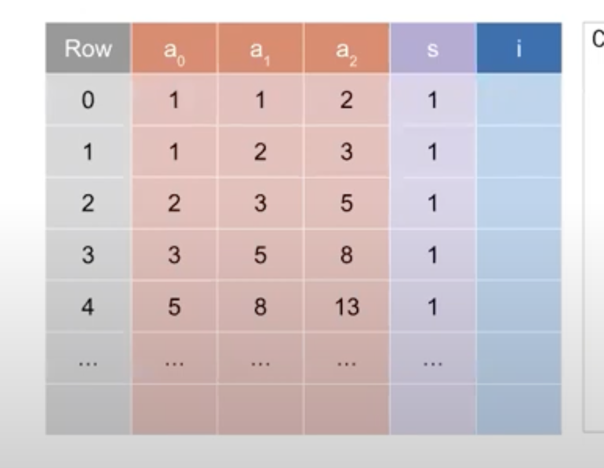

# Open Questions about Halo2

- What are the layouters/regions and why would you use that? and what is the offset here?
- What is FloorPlanner?
- Where am I enforcing the permutation check? Is `copy_advice` the way to set copy constraints? 
- What is a fiboChip, how do you define it?
- What should we pass inside instance? Why do we pass an empty vector?
- K is the size of the circuit. What does that mean? This is performed in the main function.


# Solved Questions about Halo2

Q: Is there a solidity snark verifier for halo2?

A: Yes, you can use halo2-wrong by pse for that

Q: Do you need to supply the entire witness or can you let the circuit generate it by itself?

A: You need to supply the entire witness, but, of course, you can create scripts that are able to do that. For example you can check the `assign_row` method inside the `example1.rs` file.

Q: What is the rotation doing? 

A: In the example we used the rotation feature when querying values that will be used to set up custom gates. In the case of the example we are creating a custom gate that covers only one row. So we query value from the current row using `cur()`. If we wanted to create more complex gates we could use the `next()` method to query values from the next row or also access value from a specifc row.

Q: Is the name of the constraint something arbitrary or is this encoded in the package?

A: Yes we can set any name we want

Q: What does meta represent? 

A: Meta is an instance of a default constraint system. You can see it's been used inside the mock prover when calling the configure function

```rust
        let mut cs = ConstraintSystem::default();
        let config = ConcreteCircuit::configure(&mut cs);
```

Q: What does pub a and pub b mean inside our MyCircuit struct?

A: There are just two fields assigned to the circuit struct. The pub is a rust keyword that allows you to access the field from outside the struct. These 2 fields are the used inside the `assign_first_row` method to set the first row of the circuit. The other rows of the circuit are computed starting from the first row using the `assign_row` method.

Q: Where does region come from in assign_region method (file example1.rs)?

A: This may sound confusing because it seems like the region is an input parameter coming out of nowhere. In order to understand it we should go back to the `assign_region` method defined on the Layouter trait. The assign region function takes an assignment as input which is a closure that takes a mutable reference to a Region instance as its argument, and returns a result of type AR. The closure is responsible for assigning variables and constraints to the Region. So, to answer the initial question, the region parameter used inside layouter.assign_region is not derived from any external source; rather, it is created by the assign_region method itself and passed to the closure as an argument.

Q: When would you even set the selector to 0? 

A: You can set the selector to 0 when you want to skip a constraint. Also the number of rows is always 2^k, so if you are not using the entire rows you can set the selector to 0.

# Fibonacci Circuit 

The goal is that given f(0)=x and f(1)=y, we will prove that f(9)=z

### Example 1



- Go into cargo.toml and add dependencies to that


Run 

```cargo run --bin example1```

## General structure 

**FiboChip** : Create fiboChip, 

**Config**: need to set the config